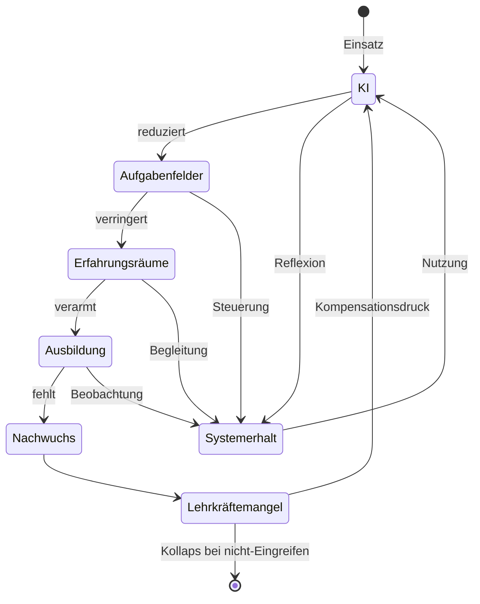

created: 20.9.2025 | [updated](https://github.com/jochen-hanisch/blog-podcast-vodcast/commits/main/Blog-Podcast-Vodcast/b-Quadrat%20-%20Der%20Blog/KI%20und%20Lehrerbildung.md): 26.12.2025 | [published](https://zenodo.org/records/###): | [Austausch](https://github.com/jochen-hanisch/blog-podcast-vodcast/discussions) | [[Hinweise]]

**Zukunft ohne Nachwuchs? Wie KI die Lehrerbildung verändert - und wie wir gegensteuern können**

# Die stille Gefahr für die Lehrerbildung

Die Lehrerbildung steht aktuell vor einer doppelten Herausforderung: Einerseits verschärfen sich strukturelle Engpässe. Lehrkräftemangel, hohe Belastung in der Schulpraxis und rückläufige Zahlen bei Lehramtsstudierenden und Absolvent:innen sind seit Jahren dokumentiert (Autorengruppe Bildungsberichterstattung, 2024; OECD, 2023). Andererseits entwickelt sich mit dem Aufkommen generativer Künstlicher Intelligenz (KI) eine zweite, bislang kaum adressierte Dynamik, die das Fundament der Lehrerbildung untergraben könnte. Denn KI-Systeme wie ChatGPT, Claude oder andere generative Modelle halten rasant Einzug in schulische und hochschulische Arbeitskontexte (Eickelmann & Gerick, 2023; Schleicher, 2023). 

Diese Entwicklungen werden im öffentlichen Diskurs häufig insbesondere im Hinblick auf Routineaufgaben wie Korrekturen, die Erstellung von Arbeitsmaterialien oder die Rückmeldung auf Lernprozesse als Entlastung interpretiert. Doch gerade diese Tätigkeiten bilden in der Ausbildung von Lehrkräften ein zentrales Erfahrungsfeld. Sie sind nicht nur kognitiv fordernd, sondern auch entscheidend für die pädagogische [[Professionalisierung]] (König & Rothland, 2021). Werden diese Aufgaben zunehmend automatisiert, betrifft dies vor allem den beruflichen Einstieg. Referendar:innen, Tutor:innen, studentische Hilfskräfte und Lehramtsstudierende in Praktika verlieren dadurch zentrale Aufgabenbereiche, die bislang zur Rollenfindung und zur Entwicklung unterrichtspraktischer Kompetenzen beitrugen (Holmes, Bialik & Fadel, 2019; Luckin et al., 2016).

Die Studie von Hosseini und Lichtinger (2025) deutet auf genau diesen Mechanismus hin. Anhand von Daten zu mehr als 62 Millionen Beschäftigten in über 285.000 US-Unternehmen zeigen sie, dass die Einführung generativer KI vor allem den Zugang zu sogenannten „Junior-Positionen“ einschränkt. Dabei ist nicht etwa eine erhöhte Kündigungsrate ursächlich, sondern eine deutliche Reduktion von Neueinstellungen. Besonders stark betroffen sind Tätigkeiten im mittleren Qualifikationssegment, also gerade jene Funktionen, in denen erste Berufserfahrungen gesammelt und Karrierewege eingeleitet werden.

Die Übertragung auf den Bildungsbereich liegt damit nahe. Wenn generative KI die Aufgaben übernimmt, die bisher Berufseinsteiger:innen vorbehalten waren, droht auch hier ein schleichender Strukturabbau, der nicht durch aktive Ausgrenzung, sondern durch unterlassene Integration initiiert und aufrecht erhalten wird. Genau dieser Prozess gefährdet die Nachwuchssicherung in einem ohnehin angespannten System. Die „stille Gefahr“ besteht somit nicht nur in einer technikbedingten Verschiebung von Aufgaben, sondern in der Erosion von Professionalisierungsräumen, ohne die Lehrerbildung nicht zukunftsfähig sein kann.

# Was die Studie zeigt

Eine umfassende empirische Studie von Hosseini und Lichtinger (2025) demonstriert erstmals systematisch die Auswirkungen der Einführung generativer Künstlicher Intelligenz (KI) auf die innerbetrieblichen Beschäftigungsstrukturen. Die Forschenden analysierten ein umfassendes Panel von über 62 Millionen Beschäftigten in 285.000 US-Unternehmen im Zeitraum von 2015 bis 2025. Als Indikator für die Einführung generativer KI nutzten sie die erstmalige Veröffentlichung von Stellenanzeigen mit dezidierten „AI-Integrator“-Rollen, was auf strategisch intendierte Implementierung hindeutet.

Die zentralen Ergebnisse sind deutlich. Unternehmen, die generative KI einführen, verzeichnen ab dem ersten Quartal 2023 einen signifikanten Rückgang von Neueinstellungen auf sogenannten Junior-Positionen, also Arbeitsplätzen für Berufseinsteiger:innen, Assistenzen oder mittelhoch qualifizierte Nachwuchskräfte. Im Gegensatz dazu bleiben Senior-Positionen entweder stabil oder wachsen sogar weiter an. Besonders bemerkenswert erschenit, dass diese Veränderung nicht durch erhöhte Kündigungen oder Arbeitsplatzabbau verursacht wird, sondern fast ausschließlich durch einen Rückgang der Neueinstellungen.

Die Autoren interpretieren diese Entwicklung als Ausdruck einer „senioritätsbasierten technologischen Disruption“ (S. 5). Das heißt, generative KI ersetzt nicht ganze Berufsgruppen, sondern verschiebt die Relevanz von Aufgaben- und Erfahrungsniveaus. Gerade dort, wo Aufgaben standardisierbar und kognitiv mittelfordernd sind, typischerweise im mittleren Qualifikationssegment, ist der Substitutionseffekt am stärksten ausgeprägt. Infolgedessen droht eine strukturelle Lücke in der beruflichen Entwicklungspipeline, die langfristig die Innovations- und Anpassungsfähigkeit von Organisationen untergraben kann (Hosseini & Lichtinger, 2025).
# Übertragung auf die Lehrerbildung

Was hat die von Hosseini und Lichtinger (2025) beschriebene senioritätsbasierte Disruption mit Schulen und Hochschulen zu tun? Sehr viel. Auch in der Lehrerbildung existiert eine funktionale Aufgabenverteilung, bei der Berufseinsteiger:innen und Studierende häufig mit Tätigkeiten betraut sind, die sich durch Routine, Standardisierung oder Vorbereitungscharakter auszeichnen. Dazu zählen insbesondere Korrekturarbeiten, Unterrichtsvorbereitungen, das Erstellen von Arbeitsmaterialien oder digitale Rückmeldungen auf Lernleistungen (Holmes, Bialik & Fadel, 2019; Luckin et al., 2016). Genau diese Aufgaben sind jedoch besonders anfällig für Automatisierung durch generative KI.

Werden solche Aufgaben künftig vermehrt von KI-Systemen übernommen, so verlieren angehende Lehrkräfte reale Lern- und Erfahrungsräume. Dabei handelt es sich nicht nur um organisatorische Tätigkeiten, sondern um entscheidende Phasen professioneller Entwicklung, in denen pädagogische Routinen, Beurteilungskompetenz und didaktische Feinfühligkeit ausgebildet werden (König & Rothland, 2021). Wenn diese Räume durch technologische Effizienzgewinne ersetzt oder eingeschränkt werden, entsteht ein doppelter Verlust:

1. Berufseinsteiger:innen finden keinen sinnvollen Platz im System, da ihre Handlungsfelder und damit ihre Erfahrungsräume schrumpfen oder entfallen.
2. Das System selbst verliert an Reproduktionsfähigkeit, da es nicht mehr aktiv ausbildet, was es mittelfristig benötigt.

Dieser Trend ist bereits heute erkennbar. Die Zahl unbesetzter Referendariatsstellen steigt in vielen Bundesländern kontinuierlich (Autorengruppe Bildungsberichterstattung, 2024), und Schulen greifen zunehmend auf Seiteneinsteiger:innen, befristete Kräfte oder digitale Assistenzsysteme zurück. Gleichzeitig werden neue Technologien oftmals primär als Effizienzverstärker eingeführt, ohne dass deren Auswirkungen auf die professionelle Sozialisation des pädagogischen Nachwuchses hinreichend reflektiert werden (Eickelmann & Gerick, 2023; Schleicher, 2023). Wenn diese Entwicklung nicht aktiv gesteuert wird, droht ein schleichender Strukturabbau im Fundament der Lehrerbildung nicht durch direkte Ausgrenzung, sondern durch stille Verdrängung.

> Zentrale Erkenntnis
> Das System steuert in keiner Phase deterministisch auf Kollaps zu. Vielmehr besteht in jedem Abschnitt der Prozesskette die Möglichkeit zur Intervention – vorausgesetzt, Reflexion, Steuerung, Begleitung und Beobachtung werden als aktive Gestaltungsaufgaben wahrgenommen. Die Lehrerbildung bleibt damit nicht Opfer des Wandels, sondern kann zum steuernden Subjekt werden.
#### **1. Zwischen C und D: Didaktische und organisatorische Steuerung des KI-Einsatzes**

  

Die Schnittstelle zwischen dem **Einsatz digitaler Assistenzsysteme** (C) und dem **Wegfall klassischer Aufgaben für Nachwuchskräfte** (D) markiert einen zentralen Punkt, an dem die Verdrängung junger Lehrkräfte aktiv aufgehalten werden kann. Die Kernproblematik liegt darin, dass gerade jene Aufgaben, die sich technisch leicht durch generative KI automatisieren lassen – etwa Korrekturen, das Formulieren von Arbeitsmaterialien oder die Erstellung von Feedback –, zu den wichtigsten Lernfeldern der pädagogischen Professionalisierung gehören (Holmes, Bialik & Fadel, 2019; König & Rothland, 2021).

  

Die Gefahr besteht nicht allein in der technischen Verfügbarkeit von KI, sondern in ihrer **unkritischen Substitution pädagogischer Lernräume**. Werden diese Aufgaben vollständig an KI delegiert, verlieren angehende Lehrkräfte nicht nur Übungsfelder, sondern auch Gelegenheiten zur Reflexion, zur Fehleranalyse und zur Ausbildung professioneller Urteilskraft – also jener Kernfähigkeiten, die Lehrerprofessionalität konstituieren (König & Rothland, 2021).

  

Daher muss die Integration von KI in die Ausbildung und Schulorganisation **didaktisch und organisatorisch gesteuert** werden. Das bedeutet: KI soll **nicht isoliert als Ersatz**, sondern **begleitend als Lernwerkzeug** eingesetzt werden – etwa im Sinne einer **„intelligenten Assistenz unter Anleitung“** (Luckin et al., 2016). Lernende Lehrkräfte könnten dadurch eigene Leistungen mit KI-Vorschlägen vergleichen, Feedback bewerten lernen oder gemeinsam mit Mentor:innen reflektieren, wann technischer Einsatz pädagogisch sinnvoll ist und wann nicht.

  

Eine solche Steuerung erfordert institutionelle Sensibilität für das, was Holmes et al. (2019) als _„cognitive displacement risk“_ bezeichnen: die Gefahr, dass genau jene kognitiven und sozialen Aufgaben ausgelagert werden, die für Lern- und Sozialisationsprozesse unverzichtbar sind. Schulen und Hochschulen müssen also bewusst definieren, **welche Aufgaben nicht automatisiert werden sollten**, weil sie für das Lernen der Lernenden (hier: Lehramtsstudierenden und Referendar:innen) selbst elementar sind.

  

> **Fazit:** Der bewusste Verzicht auf vollständige Automatisierung an dieser Stelle sichert nicht nur Professionalisierung, sondern stärkt die pädagogische Urteilskraft im Umgang mit Technologie selbst – ein Kompetenzziel, das ohnehin Teil moderner Lehrerbildung sein sollte (Eickelmann & Gerick, 2023).

---

#### **2. Zwischen E und F: Strukturelle Sicherung von Ausbildungskapazitäten**

  

Die zweite Interventionsmöglichkeit liegt zwischen dem Rückgang von Erfahrungsräumen (E) und dem **systemischen Verlust von Ausbildungskapazitäten** (F). Dieser Schritt ist entscheidend, weil er über die individuelle Betroffenheit hinaus die **institutionelle Reproduktionsfähigkeit** des gesamten Systems betrifft.

  

Fehlen dauerhaft Erfahrungsräume für den Nachwuchs, so geraten mittelfristig auch die **Strukturen der Ausbildung selbst unter Druck**: Praktikumsplätze werden weniger betreut, Mentoringprogramme reduziert, berufspraktische Anteile in der Ausbildung geschwächt. Die Folge ist eine doppelte Erosion: Es fehlen nicht nur Nachwuchskräfte, sondern auch **jene professionellen Rahmenbedingungen, die zur Ausbildung des Nachwuchses notwendig wären** (Autorengruppe Bildungsberichterstattung, 2024; König & Rothland, 2021).

  

Deshalb ist es notwendig, **gezielt institutionelle Ausbildungskapazitäten zu sichern und auszubauen**. Das bedeutet konkret:

- **Verbindliche Ressourcenzuweisung** für die Betreuung von Praktika und Referendariat,
    
- **strukturelle Verankerung von Mentoring** durch geschulte Lehrkräfte,
    
- **Finanzierung und Anerkennung von Ausbilderrollen** in Schule und Hochschule,
    
- **Weiterbildung im Bereich KI-sensibler Pädagogik**, um Ausbilder:innen auf die veränderten Anforderungen vorzubereiten (OECD, 2023; Schleicher, 2023).
    

  

Investitionen in diese Strukturen sind **kein reiner Kostenfaktor**, sondern eine Notwendigkeit zur Sicherung von Bildungsqualität. Wie die OECD (2023) betont, hängt die Resilienz von Bildungssystemen maßgeblich davon ab, **ob sie Nachwuchs systematisch entwickeln und integrieren können** – und nicht davon, ob kurzfristig durch technische Lösungen operative Lücken geschlossen werden können.

  

> **Fazit:** Der systematische Ausbau professioneller Ausbildungsstrukturen stellt sicher, dass Nachwuchskräfte nicht nur irgendwo unterkommen, sondern **gezielt begleitet, gefördert und professionalisiert werden** – auch und gerade im Zeitalter generativer KI.

Wenn du möchtest, kann ich diese Argumentation noch in eine **Kurzfassung für ein Executive Summary** oder in eine **Tabelle mit Handlungsempfehlungen** überführen.
Damit Lehrerbildung nicht Opfer ihrer eigenen Effizienzgewinne wird, braucht es gezielte Struktur- und Didaktikreformen:

- **Einstiegsphasen absichern:** Schulen und Hochschulen sollten Aufgabenräume definieren, die explizit für Nachwuchskräfte reserviert bleiben – als Lernchance und Reifefeld.
- **KI als didaktisches Werkzeug, nicht als Ersatz:** Die Integration von KI gehört ins Curriculum der Lehrerbildung – jedoch nicht als Sparmaßnahme, sondern als Teil der Professionalisierung.
- **Nachwuchskultur fördern:** Nachwuchskräfte müssen als zentrale Ressource begriffen und aktiv gefördert werden – in Mentoringstrukturen, Forschungsprojekten und Schulentwicklungsteams.

## Fazit: Zukunft ermöglichen statt beschleunigt abschaffen

Generative KI kann den Bildungsbereich entlasten – wenn wir sie als Unterstützung gestalten. Ohne bewusste Steuerung jedoch verdrängt sie jene, die wir am dringendsten brauchen: die nächste Generation an Lehrkräften. Die Studie von Hosseini & Lichtinger ist ein Frühwarnsystem. Die Lehrerbildung muss jetzt handeln – nicht erst, wenn die Lücke endgültig spürbar wird.

# Quelle(n)

- Hosseini, S. M., & Lichtinger, G. (2025). _Generative AI as Seniority-Biased Technological Change: Evidence from U.S. Résumé and Job Posting Data_.
- Autorengruppe Bildungsberichterstattung. (2024). *Bildung in Deutschland 2024*. wbv Media.
- OECD. (2023). *Education at a Glance 2023*. OECD Publishing.
- Holmes, W., Bialik, M., & Fadel, C. (2019). *Artificial Intelligence in Education*. Center for Curriculum Redesign.
- Luckin, R. et al. (2016). *Intelligence Unleashed*. Pearson.
- Hosseini, S. M., & Lichtinger, G. (2025). *Generative AI as Seniority-Biased Technological Change*. Harvard.
- König, J., & Rothland, M. (2021). *Berufseinstieg von Lehrkräften in Zeiten von Digitalisierung*. Zeitschrift für Pädagogik.

- Autorengruppe Bildungsberichterstattung. (2024). _Bildung in Deutschland 2024_. Bielefeld: wbv Media.
    
- Eickelmann, B., & Gerick, J. (2023). Digitalisierung in der Bildung nach der Pandemie – neue Dynamiken? _Zeitschrift für Erziehungswissenschaft_, _26_(2), 293–316.
    
- Holmes, W., Bialik, M., & Fadel, C. (2019). _Artificial Intelligence in Education: Promises and Implications for Teaching and Learning_. Boston: Center for Curriculum Redesign.
    
- König, J., & Rothland, M. (2021). Berufseinstieg von Lehrkräften in Zeiten von Digitalisierung und Lehrkräftemangel. _Zeitschrift für Pädagogik_, _67_(3), 251–270.
    
- Luckin, R., Holmes, W., Griffiths, M., & Forcier, L. B. (2016). _Intelligence Unleashed: An Argument for AI in Education_. Pearson.
    
- OECD. (2023). _Education at a Glance 2023: OECD Indicators_. Paris: OECD Publishing.
    
- Schleicher, A. (2023). Bildung in Zeiten von KI: Herausforderungen und Chancen. In _Bildung und Wissenschaft_, 3/2023, 12–17.
    
