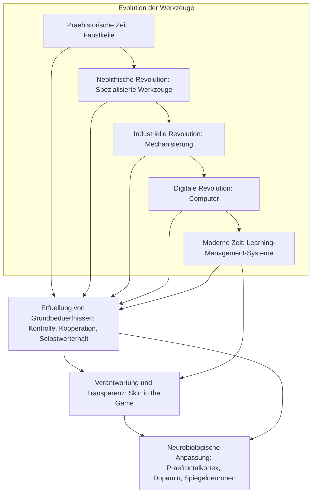

# 1 Definition

Der Werkzeuggebrauch des Menschen bezieht sich auf die Nutzung von Hilfsmitteln zur Manipulation der Umwelt, zur Verbesserung der Lebensbedingungen und zur Förderung der sozialen Interaktion. Er ist durch die Anwendung von Werkzeugen zur Erfüllung grundlegender menschlicher Bedürfnisse, wie der Kontrolle über die Umwelt und dem Wissensaustausch, gekennzeichnet. Der Begriff wird in evolutionärer, soziokultureller und pädagogischer Perspektive betrachtet und trägt zu einer besseren Anpassung an soziale und technische Umgebungen bei.

# 2 Herleitung

## 2.1 Perspektive 1: Anthropologisch-evolutionäre Perspektive

In der Anthropologie wird Werkzeuggebrauch als eine der wichtigsten Entwicklungen in der Evolution des Menschen betrachtet. Bereits vor über 2 Millionen Jahren benutzte der Mensch einfache Werkzeuge wie Faustkeile, um Nahrung zu beschaffen, zu jagen und seine Umwelt zu gestalten. Diese Entwicklung markierte einen Wendepunkt in der menschlichen Geschichte und ermöglichte die Anpassung an verschiedene Umgebungen und das Überleben in widrigen Bedingungen (Ambrose, 2001).

## 2.2 Perspektive 2: Pädagogische Perspektive

In der Bildungstheorie wird der Werkzeuggebrauch als Schlüssel zur Förderung des Lernens betrachtet. Technologien wie moderne Learning Management Systeme (LMS) werden als Werkzeuge verwendet, um Lernprozesse zu steuern, den Wissensaustausch zu fördern und soziale Interaktionen zu ermöglichen. Der Einsatz von digitalen Werkzeugen in Bildungsumgebungen fördert die Selbststeuerung der Lernenden und unterstützt kooperative Lernprozesse (Bandura, 1997).

## 2.3 Perspektive 3: Soziokulturelle Perspektive

Werkzeuge sind nicht nur funktionale Hilfsmittel, sondern auch kulturelle Artefakte, die in einem sozialen Kontext verwendet werden. In prähistorischen Gesellschaften förderte der gemeinsame Gebrauch von Werkzeugen die soziale [[Bindung]] und das kollektive Wissen. Moderne digitale Werkzeuge wie Foren und Wikis spielen eine ähnliche Rolle, indem sie den Austausch von Wissen und die Kollaboration zwischen Lernenden unterstützen (Vygotsky, 1978).

## 2.4 Beispiele

- **Beispiel 1:** Die Nutzung von Faustkeilen in prähistorischen Gesellschaften zur Beschaffung von Nahrung und Verteidigung.
- **Beispiel 2:** Der Einsatz von Learning-Management-Systemen zur Unterstützung von kooperativen Lernprozessen in modernen Bildungskontexten.

# 3 Folgerungen

- **Aspekt 1:** Werkzeuggebrauch ist ein evolutionärer Vorteil, der es Menschen ermöglicht, ihre Umwelt zu kontrollieren und sich anzupassen.
- **Aspekt 2:** In modernen digitalen Lernumgebungen erfüllen Werkzeuge dieselbe Funktion wie in prähistorischen Zeiten, indem sie die Bedürfnisse nach Kontrolle, [[Bindung]] und Wissensaustausch befriedigen.

# 4 Implikationen

- **Implikation 1:** Der Einsatz von Werkzeugen in Bildungskontexten ermöglicht eine effektivere Anpassung an komplexe Lernumgebungen.
- **Implikation 2:** Die Entwicklung von Werkzeugen spiegelt den evolutionären Fortschritt wider und zeigt, wie Menschen ihre kognitiven Fähigkeiten nutzen, um soziale und technische Herausforderungen zu bewältigen.

# 5 Zusammenfassung

Der **Werkzeuggebrauch** beschreibt die Anpassung des Menschen an seine Umwelt durch die Nutzung von Hilfsmitteln, die seine kognitiven und sozialen Fähigkeiten fördern. Von prähistorischen Werkzeugen wie dem Faustkeil bis hin zu modernen digitalen Lernsystemen erfüllen Werkzeuge grundlegende menschliche Bedürfnisse und spielen eine zentrale Rolle in der Evolution und der modernen Bildung.

# Quellen

- Ambrose, S. H. (2001). Paleolithic technology and human evolution. *Science, 291*(5509), 1748-1753.
- Bandura, A. (1997). *Self-efficacy: The exercise of control*. W.H. Freeman.
- Vygotsky, L. S. (1978). *Mind in society: The development of higher psychological processes*. Harvard University Press.

---

# 1 Erste Näherung
Um den Beweis zu führen, dass Menschen seit der Nutzung von Faustkeilen Werkzeuge verwendet haben und sich diese Entwicklung bis zum Einsatz von Learning-Management-Systemen (LMS) verfolgen lässt, müssen mehrere historische und evolutionäre Entwicklungsschritte analysiert und nahgezeichnet werden. Dieser Prozess beginnt in der Frühgeschichte der Menschheit und erstreckt sich über verschiedene Phasen der technologischen und kulturellen Entwicklung bis hin zu modernen digitalen Werkzeugen.

## 1.1 Frühgeschichte: Nutzung von Faustkeilen

Die Nutzung von Faustkeilen markiert einen entscheidenden Wendepunkt in der Evolution der menschlichen Werkzeugtechnologie. Diese Werkzeuge wurden von frühen Hominiden, wie **Homo habilis** und **Homo erectus**, vor etwa 2,6 Millionen Jahren bis zu 300.000 Jahren v. Chr. verwendet. Der Faustkeil war das erste multifunktionale Werkzeug, das als universell einsetzbares Schneide- und Schlaginstrument diente. Diese frühen Werkzeuge wurden aus Stein gefertigt und zeigen die Entwicklung kognitiver Fähigkeiten und manueller Geschicklichkeit bei unseren Vorfahren.

### Wichtige Aspekte der Nutzung von Faustkeilen:

- **Erste technische Innovation:** Die Herstellung von Faustkeilen erforderte spezifische kognitive Fähigkeiten, einschließlich der Fähigkeit, vorab zu planen und verschiedene Schritte in der Herstellung zu koordinieren. Diese Werkzeuge waren entscheidend für das Überleben, da sie es ermöglichten, Nahrung effizienter zu beschaffen (z.B. Fleisch zu zerlegen) und sich gegen Raubtiere zu verteidigen.
    
- **Evolutionäre Bedeutung:** Die Nutzung und Herstellung von Werkzeugen wie dem Faustkeil ist nicht nur ein Beweis für die frühe menschliche Fähigkeit zur Problemlösung, sondern auch ein Zeichen für die sozialen Interaktionen und die Zusammenarbeit innerhalb prähistorischer Gemeinschaften. Forschungsergebnisse deuten darauf hin, dass die Werkzeugherstellung das Gehirn in einer Weise formte, die für die spätere Entwicklung komplexer sozialer und kognitiver Fähigkeiten notwendig war (Ambrose, 2001).
    
- **Archäologische Funde:** Faustkeile wurden an vielen archäologischen Stätten weltweit gefunden, darunter in Afrika (Oldowan-Kultur) und Europa (Acheuléen-Kultur). Diese Funde zeigen, dass die Verbreitung und Verbesserung von Werkzeugen ein globaler Prozess war, der zur Weiterentwicklung der Menschheit beitrug.

**Beleg:**

1. Ambrose, S. H. (2001). Paleolithic Technology and Human Evolution. _Science_, 291(5509), 1748-1753.
2. Schick, K. D., & Toth, N. (1993). _Making Silent Stones Speak: Human Evolution and the Dawn of Technology_. Simon and Schuster.

Durch die Nutzung von Faustkeilen setzte der Mensch den ersten Schritt in der langen Entwicklung der Werkzeugnutzung, die sich bis in die heutige Zeit mit digitalen Werkzeugen wie Learning-Management-Systemen fortsetzt.

## 1.2 Neolithische Revolution: Werkzeuge und Sesshaftwerdung

Die Neolithische Revolution, die vor etwa 10.000 Jahren begann, markiert den Übergang der menschlichen Gesellschaft von nomadischen Jägern und Sammlern zu sesshaften Ackerbauern und Viehzüchtern. Diese Revolution brachte eine fundamentale Veränderung in der Nutzung von Werkzeugen und der sozialen Organisation mit sich. Neue Werkzeuge wurden entwickelt, um die Herausforderungen der landwirtschaftlichen Produktion und des täglichen Lebens in sesshaften Gemeinschaften zu bewältigen.

### Wichtige Aspekte der Werkzeuge und der Sesshaftwerdung:

- **Spezialisierung der Werkzeuge:** Im Gegensatz zu den universellen Werkzeugen der Altsteinzeit, wie dem Faustkeil, brachte die Neolithische Revolution spezialisierte Werkzeuge hervor, die für den Ackerbau und die Tierhaltung entscheidend waren. Pflüge, Sicheln und Mühlsteine wurden entwickelt, um den Boden zu bearbeiten, Getreide zu ernten und zu verarbeiten. Diese neuen Werkzeuge spiegelten die wachsende Kontrolle des Menschen über die Umwelt und die Nahrungsmittelproduktion wider (Rosenberg, 1998).
    
- **Sesshaftwerdung und soziale Strukturen:** Durch die Sesshaftwerdung bildeten sich dauerhafte Siedlungen und Dörfer, die neue soziale Strukturen erforderten. Der Ackerbau ermöglichte es, überschüssige Nahrungsmittel zu produzieren, was zur Entstehung von Handel, Eigentumsstrukturen und komplexeren Gesellschaften führte. Werkzeuge wurden nicht nur zur Nahrungsproduktion, sondern auch für den Bau von Häusern, Bewässerungssystemen und für Handwerk genutzt, was die zunehmende Spezialisierung der Arbeit in diesen Gemeinschaften unterstrich (Diamond, 1997).
    
- **Kooperation und Gemeinschaftsarbeit:** Die Arbeit in landwirtschaftlichen Gemeinschaften förderte die Zusammenarbeit, da viele Aufgaben, wie das Bestellen der Felder und der Bau von Bewässerungssystemen, gemeinschaftlich durchgeführt wurden. Werkzeuge spielten hierbei eine zentrale Rolle, da sie es ermöglichten, diese großen Projekte effizient durchzuführen. Diese kollaborative Nutzung von Werkzeugen stärkte die sozialen Bindungen innerhalb der Gemeinschaften (Flannery, 1972).
    
- **Domestikation und Werkzeuge:** Die Domestikation von Tieren brachte neue Anforderungen an Werkzeuge mit sich, wie Joche und Schubkarren, um Tiere für den Transport und die Feldarbeit zu nutzen. Dies zeigt eine zunehmende Anpassung der Werkzeuge an die Bedürfnisse der landwirtschaftlichen Arbeit und eine stärkere Ausrichtung auf die Produktivität (Childe, 1936).
    

**Beleg:**

1. Diamond, J. (1997). _Guns, Germs, and Steel: The Fates of Human Societies_. W.W. Norton & Company.
2. Rosenberg, M. (1998). Cheating at Musical Chairs: Territoriality and Sedentism in an Evolutionary Context. _Current Anthropology_, 39(5), 653-681.
3. Flannery, K. V. (1972). The Origins of the Village as a Settlement Type in Mesoamerica and the Near East: A Comparative Study. _The Prehistory of the Tehuacan Valley_, 3, 23-53.
4. Childe, V. G. (1936). _Man Makes Himself_. Watts & Co.

### Fazit:

Die Neolithische Revolution war ein entscheidender Wendepunkt in der menschlichen Geschichte. Werkzeuge spielten eine zentrale Rolle bei der Transformation der Gesellschaften von nomadischen Gruppen hin zu komplexeren, sesshaften Gemeinschaften. Diese Werkzeuge, die den landwirtschaftlichen und baulichen Fortschritt ermöglichten, markierten den Beginn spezialisierter menschlicher Aktivitäten, die auf eine effiziente Anpassung an die Umwelt abzielten.

## 1.3 Industrielle Revolution: Mechanisierung und technologische Fortschritte

Die **Industrielle Revolution** (ca. 1760–1840) führte zu tiefgreifenden technologischen, sozialen und wirtschaftlichen Veränderungen. In dieser Zeit vollzog sich der Übergang von agrarisch geprägten Gesellschaften zu Industriegesellschaften, in denen mechanisierte Produktion und technologische Innovationen im Zentrum standen. Diese Revolution prägte die Art und Weise, wie Werkzeuge genutzt und weiterentwickelt wurden, nachhaltig und ebnete den Weg für moderne technologische Entwicklungen wie digitale Lernsysteme.

### Wichtige Aspekte der Mechanisierung und technologischen Fortschritte:

- **Maschinen und Mechanisierung:** Die Einführung von Maschinen, wie der Dampfmaschine von James Watt (1769), ermöglichte die Produktion in großem Maßstab und verringerte die Abhängigkeit von manueller Arbeit. Mechanische Webstühle, Spinnmaschinen und später Motoren in der Textilindustrie führten zur Beschleunigung und Rationalisierung der Produktion, die zuvor von menschlichen Händen und einfachen Werkzeugen abhingen (Landes, 1969).
    
- **Werkzeugherstellung und -nutzung:** Mit der Industriellen Revolution ging die Verfeinerung und Massenproduktion von Werkzeugen einher. Stahl, Eisen und andere Materialien wurden effizienter verarbeitet, was zur Produktion langlebigerer und präziserer Werkzeuge führte. Werkzeuge, die früher in Handarbeit hergestellt wurden, konnten jetzt in Fabriken gefertigt werden, was ihre Verfügbarkeit und Qualität verbesserte (Mokyr, 1990).
    
- **Auswirkungen auf die Arbeitswelt und Bildung:** Die Mechanisierung veränderte nicht nur die Produktion, sondern auch die Arbeitswelt. Menschen verließen zunehmend die Landwirtschaft und suchten Arbeit in Fabriken, was die soziale Struktur erheblich veränderte. Dies führte auch zur Notwendigkeit neuer Bildungssysteme, um die Arbeiter für die industrielle Arbeitswelt zu schulen. Die Bildung wurde stärker formalisiert und Techniken wie Lesen, Schreiben und Rechnen wurden als Grundfertigkeiten gelehrt, um die neuen Technologien zu bedienen (Ashton, 1997).
    
- **Technologische Fortschritte in der [[alt Kommunikation]]:** Der Fortschritt in der Kommunikationstechnologie war ein weiteres Kennzeichen der industriellen Revolution. Die Erfindung des Telegraphen (Samuel Morse, 1837) und später des Telefons (Alexander Graham Bell, 1876) verbesserte die [[alt Kommunikation]] und den Informationsaustausch, was wiederum das Management von Unternehmen und die Koordination von Produktionsprozessen revolutionierte. Dies bereitete den Weg für moderne digitale Kommunikationssysteme und die heutigen Lernmanagementsysteme (Headrick, 2000).
    

### Wissenschaftliche Belege:

1. Landes, D. S. (1969). _The Unbound Prometheus: Technological Change and Industrial Development in Western Europe from 1750 to the Present_. Cambridge University Press.
2. Mokyr, J. (1990). _The Lever of Riches: Technological Creativity and Economic Progress_. Oxford University Press.
3. Ashton, T. S. (1997). _The Industrial Revolution, 1760–1830_. Oxford University Press.
4. Headrick, D. R. (2000). _When Information Came of Age: Technologies of Knowledge in the Age of Reason and Revolution, 1700–1850_. Oxford University Press.

### Fazit:

Die Industrielle Revolution brachte eine Welle von Innovationen, die nicht nur die Herstellung von Werkzeugen revolutionierten, sondern auch den sozialen und wirtschaftlichen Kontext veränderten. Mechanisierung und Technologie schufen die Grundlage für moderne Bildungssysteme und den technologischen Fortschritt, der schließlich zur Entwicklung von Computern und digitalen Systemen führte. Diese Phase der Werkzeugentwicklung stellt einen wichtigen Meilenstein auf dem Weg zu modernen Technologien wie Learning-Management-Systemen dar.

## 1.4 **Digitale Revolution: Von Computern zu Learning-Management-Systemen**

Die **Digitale Revolution**, die in der Mitte des 20. Jahrhunderts begann, markierte den Übergang von analogen zu digitalen Technologien. Dieser Übergang hat fast alle Bereiche der Gesellschaft grundlegend verändert, insbesondere den Bereich der Bildung. Durch die Einführung von Computern und später des Internets wurden neue Lernmethoden möglich, die schließlich zur Entwicklung moderner **Learning-Management-Systeme (LMS)** führten.

### Wichtige Aspekte der Digitalen Revolution:

- **Entwicklung der Computertechnologie:** Die Entwicklung von Computern, angefangen bei den ersten mechanischen Rechenmaschinen wie der von Charles Babbage bis hin zu den elektronischen Computern der 1940er Jahre (z.B. ENIAC), ermöglichte die Verarbeitung großer Datenmengen und die Automatisierung von Aufgaben. Die Einführung des Personal Computers in den 1970er Jahren, angeführt von Unternehmen wie IBM und Apple, machte die Technologie zugänglicher für den Einzelnen und damit auch für den Bildungsbereich (Ceruzzi, 2003).
    
- **Das Internet und die globale Vernetzung:** Die Entstehung des Internets in den 1990er Jahren revolutionierte den Informationszugang und die [[alt Kommunikation]]. Es ermöglichte den Aufbau von Netzwerken, die den Austausch von Wissen und Informationen in Echtzeit über geografische Grenzen hinweg erleichterten. Dies führte zu einer Demokratisierung des Wissens, die eine wichtige Grundlage für die Entwicklung von E-Learning und LMS war (Castells, 2000).
    
- **Frühe Lernmanagementsysteme:** Die ersten LMS wurden in den 1990er Jahren entwickelt, als Universitäten und Bildungseinrichtungen begannen, ihre Kursmaterialien online bereitzustellen. Systeme wie **WebCT** (entwickelt 1995) und **Blackboard** (gegründet 1997) waren Pioniere auf diesem Gebiet und ermöglichten es Lehrenden, Kurse online zu strukturieren, Inhalte bereitzustellen und mit Studierenden zu interagieren. Diese Systeme legten den Grundstein für die heutigen hochentwickelten Plattformen (Watson & Watson, 2007).
    
- **Moderne LMS und adaptive Lernsysteme:** Moderne LMS wie **Moodle**, **Canvas** und **Google Classroom** bieten eine Vielzahl von Funktionen, die nicht nur den Zugriff auf Lernmaterialien ermöglichen, sondern auch kollaborative Aktivitäten (z.B. Foren, Wikis), automatisierte Feedbackmechanismen und personalisierte Lernpfade anbieten. Diese Plattformen wurden so entwickelt, dass sie den Lernenden Kontrolle über ihren Lernprozess geben, soziale Bindungen durch kollaborative Werkzeuge stärken und personalisiertes Feedback ermöglichen, was dem Prinzip der Selbststeuerung entspricht (Graf & List, 2005).
    
- **Technologische Weiterentwicklung und Integration von Künstlicher Intelligenz:** Mit der Integration von **Künstlicher Intelligenz (KI)** und **Big Data** in LMS werden Lernprozesse zunehmend personalisiert. Adaptive Lernsysteme analysieren das Verhalten und die Fortschritte der Lernenden und passen die Lerninhalte entsprechend an. Diese Entwicklungen bauen auf den [[Erkenntnis|Erkenntnissen]] aus der Kognitionswissenschaft auf, die zeigen, dass personalisierte Lernumgebungen das [[Lernen als universelles Prinzip]] effizienter gestalten können (Chen, M. Y., 2020).
   

### Wissenschaftliche Belege:

1. Ceruzzi, P. E. (2003). _A History of Modern Computing_. MIT Press.
2. Castells, M. (2000). _The Rise of the Network Society: The Information Age: Economy, Society, and Culture_. Wiley-Blackwell.
3. Watson, W. R., & Watson, S. L. (2007). An Argument for Clarity: What Are Learning Management Systems, What Are They Not, and What Should They Become? _TechTrends_, 51(2), 28–34.
4. Graf, S., & List, B. (2005). An Evaluation of Open Source E-Learning Platforms Stressing Adaptation Issues. In _Proceedings of the 5th IEEE International Conference on Advanced Learning Technologies (ICALT)_.
5. Chen, M. Y. (2020). Artificial Intelligence in E-Learning: A Review of State-of-the-Art Technologies in Computer-Assisted Learning Systems. _Educational Technology & Society_, 23(3), 162–173.

### Fazit:

Die Digitale Revolution hat das Bildungswesen grundlegend verändert, indem sie die Möglichkeiten für den Zugang zu Wissen und die Interaktion in Lernumgebungen erweitert hat. Von den ersten Computern bis hin zu modernen LMS bietet diese Entwicklung eine kontinuierliche Verbesserung der Werkzeuge, die die menschlichen Bedürfnisse nach Kontrolle, Selbstwerterhalt, Zusammenarbeit und personalisiertem [[Lernen als universelles Prinzip]] befriedigen. Die Fortschritte in der Technologie haben nicht nur den Zugang zu Wissen demokratisiert, sondern auch die Art und Weise, wie Menschen [[Lernen als universelles Prinzip]] und interagieren, neu definiert.

## 1.5 Verbindung der Theorien: Kooperation und Verantwortung

Die Verbindung der Theorien zur **Werkzeugnutzung**, **Kooperation** und **Verantwortung** lässt sich über die gesamte Entwicklungsgeschichte des Menschen hinweg nachweisen – von der prähistorischen Nutzung von Faustkeilen bis hin zu modernen digitalen Systemen wie Learning-Management-Systemen (LMS). Diese Theorien haben tiefe Verbindungen in Bezug auf die sozialen und biologischen Mechanismen, die das menschliche Verhalten prägen.

### 1.5.1 Kooperation als treibende Kraft in der Evolution

- Die Fähigkeit zur **Kooperation** war seit der prähistorischen Zeit eine entscheidende Überlebensstrategie. In frühen Gesellschaften nutzten die Menschen gemeinsam Werkzeuge, um Herausforderungen zu bewältigen, wie die Jagd oder den Bau von Unterkünften. Diese kooperative Nutzung von Werkzeugen ermöglichte es Gruppen, ihre Ressourcen effizient zu nutzen und soziale Bindungen zu stärken.
- **Beispiel:** Die Herstellung und der Gebrauch von Faustkeilen (Ambrose, 2001) erforderten eine gewisse Zusammenarbeit und Wissenstransfer zwischen den Individuen, was soziale Bindungen und Gruppenstabilität stärkte. Diese Zusammenarbeit im Werkzeuggebrauch ist auch in modernen digitalen Umgebungen sichtbar, wie bei der kollaborativen Nutzung von Wikis in LMS.

### 1.5.2 Verantwortung und „Skin in the Game“

- Das Konzept der **Verantwortung** („Skin in the Game“), wie von Nassim Taleb beschrieben, zeigt, dass Menschen bewusster und erfolgreicher handeln, wenn sie persönlich für ihre Handlungen verantwortlich gemacht werden. Diese Theorie lässt sich sowohl in prähistorischen Kontexten als auch in modernen digitalen Lernumgebungen anwenden.
- **Verknüpfung zur Werkzeugnutzung:** In prähistorischen Zeiten war die Übernahme von Verantwortung für die Herstellung und den Einsatz von Werkzeugen entscheidend für das Überleben einer Gruppe. Fehlerhafte Werkzeuge oder falsche Handhabung konnten das Überleben gefährden. Diese Verantwortlichkeit überträgt sich auf heutige digitale Lernumgebungen, in denen **LMS** durch Protokollierung und Versionshistorien jede Aktion nachvollziehbar machen und Lernende für ihre Beiträge und Fehler verantwortlich sind.
- **Beispiel:** Wenn Lernende in einem **Wiki** eines LMS arbeiten, wird jede Änderung, die sie vornehmen, protokolliert. Diese Transparenz fördert ein höheres Maß an Verantwortung, ähnlich wie in frühen Gesellschaften, in denen das Wissen über den Werkzeuggebrauch weitergegeben und gepflegt werden musste.

### 1.5.3 Soziale Bindung und Transparenz

- In **prähistorischen Gesellschaften** förderten soziale Interaktionen und Kooperationen die Gruppenbindung und das gemeinsame [[Lernen als universelles Prinzip]]. Dieses Muster wiederholt sich in digitalen Lernsystemen. LMS ermöglichen durch Foren, Chats und Wikis die Stärkung von sozialen Bindungen. Diese Interaktionen sind entscheidend für den Aufbau eines positiven Lernumfelds und für den Erfolg der Gemeinschaft.
- **Beispiel:** Die Verwendung eines kollaborativen Werkzeugs wie eines Wikis im LMS schafft nicht nur eine Plattform für den Wissensaustausch, sondern stärkt auch das Verantwortungsgefühl unter den Lernenden. Sie sind sich bewusst, dass ihre Beiträge zur Gemeinschaft sichtbar sind und Auswirkungen auf den Lernerfolg der Gruppe haben.

### 1.5.4 Neurobiologische Unterstützung der Verbindung

- Studien zeigen, dass die Nutzung von Werkzeugen und Kooperation eng mit bestimmten Hirnprozessen verbunden ist. Der **Präfrontalkortex** spielt eine wichtige Rolle bei der Planung, Problemlösung und dem Gebrauch von Werkzeugen (Stout, 2015). Diese Fähigkeiten wurden im Laufe der Evolution durch die Zusammenarbeit und den Werkzeuggebrauch gefördert.
- **Verbindung zur digitalen Welt:** Im digitalen Kontext von LMS sehen wir ähnliche Aktivierungen im Gehirn bei der Lösung von Aufgaben, die Zusammenarbeit und Planung erfordern. Kollaborative Aktivitäten in LMS regen den gleichen Teil des Gehirns an, der für die Planung und Ausführung von kooperativen Handlungen verantwortlich ist.

### Wissenschaftliche Quellen

1. Ambrose, S. H. (2001). Paleolithic Technology and Human Evolution. _Science_, 291(5509), 1748-1753.
2. Taleb, N. N. (2018). _Skin in the Game: Hidden Asymmetries in Daily Life_. Random House.
3. Stout, D., et al. (2015). The Evolution of Cognitive Control and the Premotor Systems. _Current Anthropology_, 56(S12), S255-S265.
### Fazit:

Die Theorien zur Kooperation, Verantwortung und Werkzeugnutzung sind eng miteinander verknüpft und ziehen sich von prähistorischen Zeiten bis in die moderne digitale Lernwelt. Menschen haben seit jeher Werkzeuge verwendet, um Herausforderungen gemeinsam zu bewältigen, und sie haben dabei Verantwortung übernommen. Diese Mechanismen haben sich im digitalen Raum nicht verändert, sondern durch LMS und moderne Technologie eine neue Form gefunden. Die neurobiologischen Grundlagen, die Kooperation und Verantwortung unterstützen, sind weiterhin ein entscheidender Faktor für die menschliche Entwicklung und das [[Lernen als universelles Prinzip]].

## 1.6 Neurobiologischer Beweis: Evolutionäre Anpassung an Werkzeuge

Der menschliche Gebrauch von Werkzeugen, der in der Frühgeschichte mit Faustkeilen begann und sich bis zu modernen digitalen Werkzeugen wie Learning-Management-Systemen (LMS) entwickelt hat, ist tief in der menschlichen Biologie verankert. Neurobiologische Forschungen zeigen, dass die Nutzung von Werkzeugen und die damit verbundene Kooperation eng mit der Evolution des menschlichen Gehirns und bestimmten kognitiven Prozessen verknüpft ist.

### Wichtige neurobiologische Aspekte der Werkzeugnutzung:

1. **Aktivierung des Präfrontalkortex:**
   
   - Der **Präfrontalkortex**, der für höhere kognitive Funktionen wie Planung, Problemlösung und das Treffen von Entscheidungen verantwortlich ist, spielt eine entscheidende Rolle bei der Werkzeugnutzung. Studien haben gezeigt, dass die Nutzung von Werkzeugen bei Menschen und ihren Vorfahren zur Stimulation und Weiterentwicklung dieser Hirnregion führte.
   - **Beleg:** Untersuchungen an prähistorischen Werkzeugen zeigen, dass die kognitiven Fähigkeiten, die für deren Herstellung und Nutzung erforderlich waren, zu einer verstärkten Aktivierung und Entwicklung des Präfrontalkortex führten (Stout, D. et al., 2015). Dieser Teil des Gehirns ermöglichte es den Menschen, zukünftige Handlungen zu planen, den Werkzeuggebrauch zu verfeinern und komplexe soziale Interaktionen zu koordinieren.
2. **Spiegelneuronen und Kooperation:**
   
   - **Spiegelneuronen**, die beim Beobachten und Nachahmen von Handlungen anderer aktiviert werden, spielen eine zentrale Rolle in der Werkzeugnutzung und der sozialen Zusammenarbeit. Diese Neuronen ermöglichen es den Menschen, voneinander zu [[Lernen als universelles Prinzip]], was besonders bei der Weitergabe von Wissen über den Werkzeuggebrauch wichtig ist.
   - **Beleg:** Studien zur Werkzeugnutzung bei Menschen und Schimpansen zeigen, dass Spiegelneuronen aktiviert werden, wenn ein Individuum beobachtet, wie ein anderes ein Werkzeug verwendet. Dies legt nahe, dass die Fähigkeit zur Kooperation und zum [[Lernen als universelles Prinzip]] von anderen tief in den neuronalen Schaltkreisen des Gehirns verankert ist (Rizzolatti & Craighero, 2004).
3. **Belohnungssystem und Dopamin:**
   
   - Das menschliche Gehirn ist darauf programmiert, positive Rückmeldungen und Erfolge zu belohnen. Wenn Werkzeuge erfolgreich verwendet werden, um ein Ziel zu erreichen, setzt das Gehirn **Dopamin** frei, was das Belohnungssystem aktiviert und das Verhalten verstärkt.
    - **Beleg:** Dopamin spielt eine zentrale Rolle im **Belohnungssystem des Gehirns** und wird bei erfolgreich durchgeführten Handlungen freigesetzt, einschließlich der Nutzung von Werkzeugen oder digitalen Technologien wie LMS (Schultz, 2015). Diese positive Rückkopplung fördert Lernprozesse und motiviert den weiteren Einsatz von Werkzeugen.
4. **Evolution der Feinmotorik und Hand-Auge-Koordination:**
    
    - Die Entwicklung der **Feinmotorik** und der **Hand-Auge-Koordination** ist ebenfalls eine wesentliche Folge der evolutionären Anpassung an die Werkzeugnutzung. Diese motorischen Fähigkeiten sind entscheidend für die präzise Nutzung von Werkzeugen, sowohl in der physischen Welt als auch in der digitalen Umgebung, etwa beim Umgang mit Computern und LMS.
    - **Beleg:** Untersuchungen zu den evolutionären Mechanismen, die die Hand-Auge-Koordination bei frühen Menschen und Hominiden entwickelt haben, zeigen, dass die Fähigkeit, Werkzeuge präzise zu führen, einen evolutionären Vorteil bot (Gibson, 1993). Diese Fähigkeiten bleiben auch im digitalen Zeitalter von Bedeutung, wenn Menschen mit komplexen digitalen Schnittstellen interagieren.

### Fazit:

Die Nutzung von Werkzeugen ist nicht nur ein kulturelles Phänomen, sondern tief in der menschlichen Neurobiologie verwurzelt. Vom Faustkeil bis hin zu digitalen Lernsystemen aktiviert der Werkzeuggebrauch spezifische Hirnregionen, die für Planung, Problemlösung und soziale Interaktionen verantwortlich sind. Neurobiologische Studien belegen, dass diese Prozesse evolutionär verankert sind und weiterhin die Grundlage für den erfolgreichen Einsatz von modernen digitalen Werkzeugen wie LMS bilden.

### Wissenschaftliche Quellen:

1. Stout, D., et al. (2015). The Evolution of Cognitive Control and the Premotor Systems. _Current Anthropology_, 56(S12), S255-S265.
2. Rizzolatti, G., & Craighero, L. (2004). The Mirror-Neuron System. _Annual Review of Neuroscience_, 27(1), 169-192.
3. Schultz, W. (2015). Neuronal Reward and Decision Signals: From Theories to Data. _Physiological Reviews_, 95(3), 853-951.
4. Gibson, K. R. (1993). Tool Use, Language, and Social Behavior in Relationship to Information Processing Capacities. _The Cognitive Neurosciences_, MIT Press.

Diese neurobiologischen Belege zeigen, wie tief die Entwicklung und Nutzung von Werkzeugen im menschlichen Gehirn verwurzelt ist und wie diese evolutionären Anpassungen auch in modernen digitalen Lernumgebungen eine Rolle spielen.
### Fazit:

Die Entwicklung der menschlichen Werkzeugnutzung, die in der prähistorischen Zeit mit dem Faustkeil begann, erstreckt sich bis in das digitale Zeitalter und wird durch die modernen Technologien der Lernmanagementsysteme (LMS) fortgeführt. Werkzeuge haben seit jeher eine zentrale Rolle dabei gespielt, die grundlegenden menschlichen Bedürfnisse zu erfüllen – sei es Kontrolle über die Umwelt, Kooperation oder die Übernahme von Verantwortung. Diese evolutionäre Reise von der Nutzung einfacher Werkzeuge bis hin zu komplexen digitalen Systemen zeigt, dass die menschliche Anpassungsfähigkeit, basierend auf Werkzeuggebrauch und sozialer Interaktion, ein Schlüssel für den Fortschritt ist.

### Wichtige Punkte im Überblick:

- **Werkzeuge als Antwort auf Bedürfnisse:** Von den ersten Faustkeilen über spezialisierte Werkzeuge der Neolithischen Revolution bis zu LMS, dienten und dienen Werkzeuge dazu, die Umwelt zu kontrollieren, [[Ressourcen]] zu optimieren und das Überleben in einer sozialen Gemeinschaft zu sichern. Diese Funktion bleibt im digitalen Zeitalter relevant, wo LMS die gleichen Bedürfnisse durch virtuelle Lernräume erfüllen.
    
- **Kooperation und soziale [[Bindung]]:** Werkzeuge wurden nicht nur individuell genutzt, sondern auch gemeinschaftlich, was soziale Bindungen und Kooperation förderte. Dieses kooperative Verhalten wird durch moderne LMS wie Wikis und Foren repliziert, wo gemeinschaftliches [[Lernen als universelles Prinzip]] und Wissensaustausch im Vordergrund stehen.
    
- **Verantwortung und Transparenz:** Die Übernahme von Verantwortung für die eigene Arbeit war sowohl in prähistorischen als auch in modernen Gesellschaften entscheidend. Im digitalen Raum wird diese Verantwortung durch transparente Protokolle und nachvollziehbare Aktionen in einem LMS gestärkt, was eine Kultur der Verantwortung und Verbesserung fördert.
    
- **Neurobiologische Belege:** Studien zeigen, dass die Nutzung von Werkzeugen tief in den neuronalen Strukturen des Menschen verwurzelt ist. Der Präfrontalkortex, der für Planung und Problemlösung verantwortlich ist, und das Dopamin-getriebene Belohnungssystem zeigen, dass die Evolution des Gehirns auf Werkzeugnutzung ausgerichtet ist – eine Fähigkeit, die im digitalen Zeitalter von LMS weiter genutzt wird.
    

### Schlussfolgerung:

Die kontinuierliche Entwicklung der Werkzeuge von den einfachsten prähistorischen Steinwerkzeugen bis hin zu hochkomplexen digitalen Lernumgebungen verdeutlicht, dass menschliche Innovation und Anpassungsfähigkeit eng mit dem [[Bedürfnis]] nach Kontrolle, Kooperation und Verantwortungsübernahme verknüpft sind. Diese evolutionäre Reise ist durch neurobiologische Prozesse tief im Menschen verankert und zeigt, dass auch im digitalen Zeitalter diese Mechanismen weiterhin die Grundlage für den Erfolg und das [[Lernen als universelles Prinzip]] darstellen.

*Abbildung 1: Entwicklung von der prähistorischen Werkzeugnutzung bis zu modernen Learning-Management-Systemen (eig. Darstellung)*

# 2 Erweiterter Beweis: Menschliche Werkzeuge von Faustkeilen bis zu Learning-Management-Systemen

Dieser erweiterte Beweis baut auf der bisherigen Argumentation auf, indem er die Entwicklung von Werkzeugen vom Faustkeil bis hin zu modernen digitalen Lernsystemen wie LMS verfolgt und dies mit wissenschaftlichen  [[Erkenntnis|Erkenntnissen]]  und deinen eigenen Beobachtungen untermauert. Deine  [[Erkenntnis|Erkenntnisse]]  über menschliche Bedürfnisse, Kooperation, Verantwortung und Technologie als Werkzeug werden durch wissenschaftliche Quellen gestützt und miteinander verknüpft.

## 2.1 Menschliche Grundbedürfnisse und Werkzeuge

Werkzeuge waren in der menschlichen Geschichte schon immer entscheidend, um die Grundbedürfnisse zu befriedigen. Die Nutzung von Werkzeugen, die seit dem Faustkeil bis zu modernen digitalen Systemen wie Learning-Management-Systemen (LMS) reicht, hat sich als eine essenzielle Methode zur Anpassung und Optimierung der menschlichen Umwelt etabliert. Im Zentrum dieser Entwicklung steht die Befriedigung der Grundbedürfnisse, wie sie etwa in der [[Schema|Schematherapie]] beschrieben werden:

### 2.1 Menschliche Grundbedürfnisse und Werkzeuge

Die kontinuierliche Nutzung von Werkzeugen hat es den Menschen seit der prähistorischen Zeit ermöglicht, ihre Grundbedürfnisse zu befriedigen. Diese Bedürfnisse, wie sie in der Schematherapie definiert sind – [[Bindung]], Kontrolle nach außen (Autonomie), Selbst-Kontrolle nach innen, Selbstwerterhöhung und Selbstwertschutz sowie die Vermeidung von Unlust bzw. das Streben nach Lust – bilden die Grundlage menschlicher Handlungen und werden seit jeher durch Werkzeuge unterstützt, angefangen beim Faustkeil bis hin zu modernen digitalen Tools wie Learning-Management-Systemen (LMS).

#### 2.1.1 Bindung

- **Beschreibung:** Menschen haben ein tiefes [[Bedürfnis]] nach sozialer [[Bindung]] und Zugehörigkeit. [[Bindung]] ist essenziell für das emotionale Wohlbefinden und für das [[Lernen als universelles Prinzip]] in sozialen Gruppen.
- **Verknüpfung mit Werkzeugen:** Bereits in prähistorischen Gemeinschaften wurden Werkzeuge wie der Faustkeil oft gemeinschaftlich genutzt, was die Kooperation und sozialen Bindungen stärkte. In modernen Lernumgebungen fördern LMS Kollaboration und soziale Interaktion, indem sie Tools wie Foren und Wikis bereitstellen, in denen Lernende zusammenarbeiten und Wissen austauschen.
- **Wissenschaftlicher Beleg:** Wygotskijs soziokulturelle Theorie betont, dass [[Lernen als universelles Prinzip]] durch soziale Interaktionen und die Verwendung kultureller Werkzeuge gefördert wird (Vygotsky, 1978). Diese Werkzeuge, ob physisch oder digital, erleichtern die Bildung von sozialen Bindungen.

#### 2. **Kontrolle nach außen (Autonomie)**

- **Beschreibung:** Menschen haben das Bedürfnis, ihre Umgebung zu beeinflussen und Kontrolle über ihre Handlungen zu haben. Dies stärkt das Gefühl von Autonomie und Selbstbestimmung.
- **Verknüpfung mit Werkzeugen:** Werkzeuge wie der Faustkeil ermöglichten es den Menschen, ihre Umgebung zu beherrschen und Kontrolle über ihre Existenz zu gewinnen. In modernen digitalen Umgebungen bieten LMS Lernenden die Möglichkeit, ihre Lernpfade individuell zu steuern und Fortschritte zu überwachen, was das [[Bedürfnis]] nach Autonomie erfüllt.
- **Wissenschaftlicher Beleg:** Banduras Theorie der Selbstwirksamkeit beschreibt die Bedeutung von Kontrolle und Autonomie für den Erfolg des Lernprozesses (Bandura, 1997). Die Fähigkeit, die eigene Umgebung zu beeinflussen, ist entscheidend für das [[Lernen als universelles Prinzip]] und Wohlbefinden.

#### 3. Impuls- und Emotionskontrolle

- **Beschreibung:** Menschen haben das Bedürfnis, ihre Emotionen und Impulse zu regulieren. Dieses [[Bedürfnis]] nach Selbstregulation fördert verantwortungsbewusstes Handeln.
- **Verknüpfung mit Werkzeugen:** Die Nutzung von Werkzeugen erfordert die Fähigkeit zur Selbstkontrolle, sei es in der prähistorischen Jagd oder in modernen digitalen Lernumgebungen. LMS unterstützen die Selbstregulation der Lernenden durch klare Strukturen, Fortschrittsverfolgung und Feedback-Systeme.
- **Wissenschaftlicher Beleg:** Talebs „Skin in the Game“-Theorie betont die persönliche Verantwortung in Entscheidungsprozessen, die Selbstkontrolle fördert (Taleb, 2018). Studien zur Verhaltensökonomie stützen diese Theorie und zeigen, dass Menschen bessere Entscheidungen treffen, wenn sie persönlich betroffen sind (Kahneman & Tversky, 1979).

#### 4. **Selbstwerterhöhung und Selbstwertschutz**

- **Beschreibung:** Menschen haben ein grundlegendes [[Bedürfnis]], ihren Selbstwert zu steigern und zu schützen. Anerkennung und Leistungserfolge spielen dabei eine wichtige Rolle.
- **Verknüpfung mit Werkzeugen:** In prähistorischen Gemeinschaften war die Fähigkeit, Werkzeuge wie den Faustkeil zu beherrschen, ein Zeichen von sozialem Status und Kompetenz. Moderne LMS bieten Lernenden Anerkennung durch Gamification-Elemente wie Badges und Zertifikate, die den Selbstwert stärken.
- **Wissenschaftlicher Beleg:** Maslows Bedürfnishierarchie hebt die Bedeutung von Anerkennung und Selbstwert für die persönliche Entwicklung hervor (Maslow, 1943). LMS unterstützen dies durch die Möglichkeit, Fortschritte zu visualisieren und Erfolge zu feiern.

#### 5. Unlust-Vermeidung / Lust

- **Beschreibung:** Menschen streben danach, Unlust zu vermeiden und Lust zu maximieren. Werkzeuge helfen, Aufgaben zu erleichtern und stressige Situationen zu minimieren.
- **Verknüpfung mit Werkzeugen:** In prähistorischen Zeiten halfen Werkzeuge wie der Faustkeil dabei, Anstrengungen zu minimieren und den Alltag zu erleichtern. Moderne LMS erleichtern den Lernprozess, indem sie klare Strukturen und ansprechende Inhalte bereitstellen, was Frustration mindert und positive Lernerfahrungen fördert.
- **Wissenschaftlicher Beleg:** Die Schematherapie beschreibt die Vermeidung von Unlust als zentrales menschliches [[Bedürfnis]] (Young et al., 2003). LMS können durch benutzerfreundliches Design und intuitive Navigation Frustration reduzieren und Freude am [[Lernen als universelles Prinzip]] fördern (O’Brien & Toms, 2008).

## 2.2 Werkzeuge als Anpassung an die Umwelt: Historische Entwicklung

Werkzeuge haben in der Menschheitsgeschichte immer eine entscheidende Rolle gespielt, um sich an die Umwelt anzupassen. Die historische Entwicklung zeigt, dass Werkzeuge vom Faustkeil bis hin zu komplexen digitalen Systemen dazu dienten, die Kontrolle über die Umgebung zu verbessern, soziale Strukturen zu stärken und das Überleben zu sichern. Dieser Abschnitt beleuchtet die wichtigsten Meilensteine in der Werkzeugentwicklung und deren Beitrag zur Anpassung an die Umwelt.

### 2.2.1 Prähistorische Werkzeuge und der Faustkeil

- **Beschreibung:** Der Faustkeil, einer der frühesten und bekanntesten Werkzeuge, entstand vor etwa 1,75 Millionen Jahren und wurde in der Altsteinzeit (Paläolithikum) genutzt. Er wurde vor allem zum Schneiden, Zerkleinern und zur Jagd verwendet. Der Faustkeil ermöglichte es frühen Menschen, ihre körperlichen Fähigkeiten zu erweitern und effizienter mit ihrer Umgebung umzugehen, insbesondere bei der Nahrungsbeschaffung und dem Bau von Schutzvorrichtungen.
- **Wissenschaftlicher Beleg:** Archäologische Studien belegen, dass Werkzeuge wie der Faustkeil den Menschen in die Lage versetzten, besser an die natürlichen Bedingungen angepasst zu überleben. Dies führte zu einer beschleunigten Entwicklung von kognitiven Fähigkeiten und gesellschaftlichen Strukturen (Ambrose, 2001; Wynn & Coolidge, 2010). Zudem zeigen Funde, dass die Werkzeugherstellung und -verwendung bereits frühe Formen von [[Lernen als universelles Prinzip]] und Wissensaustausch in prähistorischen Gesellschaften förderte (Toth & Schick, 2009).

### 2.2.2 Die Entwicklung landwirtschaftlicher Werkzeuge

- **Beschreibung:** Mit der Neolithischen Revolution vor etwa 12.000 Jahren gingen Menschen von einer nomadischen Lebensweise zu einer sesshaften Lebensweise über. Dieser Übergang wurde durch die Entwicklung landwirtschaftlicher Werkzeuge wie Pflüge und Sicheln ermöglicht. Diese Werkzeuge veränderten die menschliche Interaktion mit der Umwelt grundlegend, indem sie die Produktion von Nahrungsmitteln effizienter gestalteten und die Grundlage für komplexere soziale Strukturen legten.
- **Wissenschaftlicher Beleg:** Forschungen zeigen, dass landwirtschaftliche Werkzeuge eine Schlüsselrolle in der Transformation von nomadischen Gesellschaften zu sesshaften Zivilisationen spielten, indem sie die Nahrungsmittelproduktion erhöhten und dadurch das Bevölkerungswachstum und die Entstehung von Städten förderten (Diamond, 1997; Bellwood, 2005). Diese neuen sozialen Strukturen wurden durch die erhöhte Produktion von Ressourcen und den gemeinsamen Einsatz von landwirtschaftlichen Technologien gestärkt.

### 2.2.3 Industrielle Revolution und mechanisierte Werkzeuge

- **Beschreibung:** Die Industrielle Revolution des 18. und 19. Jahrhunderts führte zur Mechanisierung und Automatisierung von Werkzeugen, was eine deutliche Erhöhung der Produktivität und eine grundlegende Umgestaltung von Arbeitsstrukturen zur Folge hatte. Werkzeuge wie Dampfmaschinen und Webstühle waren nicht mehr nur einfache Handgeräte, sondern komplexe mechanische Systeme, die die industrielle Massenproduktion ermöglichten.
- **Wissenschaftlicher Beleg:** Historiker und Wirtschaftswissenschaftler zeigen, dass die Industrialisierung einen fundamentalen Wandel in der Menschheitsgeschichte darstellte, der nicht nur die Produktion beschleunigte, sondern auch die soziale und wirtschaftliche Struktur der Gesellschaft veränderte (Landes, 1969; Mokyr, 1990). Die Industrielle Revolution ermöglichte es den Menschen, ihre Umwelt in nie dagewesenem Umfang zu kontrollieren und zu gestalten.

#### 2.2.4 Moderne Technologien und digitale Werkzeuge

- **Beschreibung:** Im 20. und 21. Jahrhundert hat die Entwicklung von digitalen Werkzeugen, insbesondere Computern und dem Internet, eine neue Ära der Anpassung an die Umwelt eingeläutet. Tools wie Learning-Management-Systeme (LMS) ermöglichen es, Wissen zu speichern, zu teilen und Lernprozesse zu steuern. Diese Technologien bieten neue Möglichkeiten zur Anpassung an die komplexen Anforderungen moderner Gesellschaften.
- **Wissenschaftlicher Beleg:** Studien im Bereich der digitalen Bildung zeigen, dass digitale Werkzeuge wie LMS die Lernprozesse verbessern, indem sie individuelle Lernpfade ermöglichen und soziale Interaktionen fördern (Means et al., 2013). Die Entwicklung und Nutzung digitaler Werkzeuge entspricht dem evolutionären Muster, Werkzeuge zu entwickeln, die die Anpassung an neue Umweltbedingungen erleichtern.

## 2.3 Prähistorische Kollaboration als Modell für moderne digitale Räume

Die Zusammenarbeit in prähistorischen Gesellschaften kann als Modell für moderne digitale Lernräume dienen. In beiden Kontexten werden grundlegende menschliche Bedürfnisse wie [[Bindung]], soziale Kooperation und Wissensaustausch durch Werkzeuge und Technologien unterstützt. Prähistorische Gesellschaften, die auf Kooperation angewiesen waren, um zu überleben, zeigen erstaunliche Parallelen zu den kooperativen Prozessen in modernen digitalen Lernumgebungen wie Learning-Management-Systemen (LMS). Diese Verbindung lässt sich anhand der folgenden Aspekte darstellen:

### 2.3.1 Soziale Kooperation in prähistorischen Gesellschaften

- **Beschreibung:** Prähistorische Menschen lebten in kleinen, kooperativen Gruppen, in denen das Überleben oft von der Fähigkeit abhing, effektiv zusammenzuarbeiten. Dies umfasste gemeinsame Jagd, das Teilen von Ressourcen und Wissen über die Herstellung und Nutzung von Werkzeugen (Boehm, 2012). Diese Kooperation schuf starke soziale Bindungen und war entscheidend für die Entwicklung kognitiver Fähigkeiten sowie das Überleben der Gruppe.
- **Wissenschaftlicher Beleg:** Archäologische Funde und anthropologische Studien zeigen, dass die Fähigkeit zur Kooperation ein wichtiger evolutionärer Vorteil war, der es prähistorischen Gesellschaften ermöglichte, in komplexen und oft widrigen Umgebungen zu überleben (Fry, 2007; Boehm, 2012). Diese sozialen Dynamiken waren entscheidend, um Herausforderungen wie die Jagd und den Schutz vor Gefahren zu bewältigen.

### 2.3.2 Parallelen zu modernen digitalen Lernräumen

- **Beschreibung:** In modernen digitalen Lernumgebungen wie LMS spiegeln sich ähnliche kooperative Dynamiken wider. Lernende arbeiten zusammen in Foren, Wikis und anderen kollaborativen Plattformen, um gemeinsam Wissen zu generieren, zu teilen und voneinander zu [[Lernen als universelles Prinzip]]. Diese digitale Zusammenarbeit fördert nicht nur den Wissenserwerb, sondern auch soziale Bindungen zwischen den Teilnehmenden.
- **Wissenschaftlicher Beleg:** Studien zur digitalen Bildung zeigen, dass kollaborative Lernumgebungen das [[Lernen als universelles Prinzip]] und die soziale Interaktion verbessern. Durch die gemeinsame Bearbeitung von Aufgaben und den Austausch von Ideen in einem LMS wird das soziale [[Lernen als universelles Prinzip]] gefördert, was zu besseren Lernergebnissen und tieferem Verständnis führt (Means et al., 2013; Kirschner et al., 2018).

### 2.3.3 Werkzeuge als Grundlage für Kollaboration

- **Beschreibung:** In prähistorischen Gesellschaften waren Werkzeuge zentrale Elemente, die die Zusammenarbeit erleichterten. Die Herstellung und gemeinsame Nutzung von Werkzeugen wie Faustkeilen oder Jagdwaffen war ein starkes Bindeglied innerhalb der Gruppe. Moderne digitale Werkzeuge wie LMS fungieren in ähnlicher Weise als Plattformen, die soziale Interaktion und Zusammenarbeit unterstützen.
- **Wissenschaftlicher Beleg:** Wygotskijs soziokulturelle Theorie betont, dass Werkzeuge nicht nur physische Objekte sind, sondern auch kulturelle Artefakte, die das [[Lernen als universelles Prinzip]] und die Kooperation innerhalb einer Gesellschaft beeinflussen. In modernen digitalen Räumen sind LMS solche „kulturellen Werkzeuge“, die die Zusammenarbeit fördern (Vygotsky, 1978).

### 2.3.4 Gemeinsames Lernen und Wissensaustausch

- **Beschreibung:** Prähistorische Menschen teilten ihr Wissen durch gemeinschaftliche Aktivitäten wie die Jagd oder das Sammeln von Nahrung. In ähnlicher Weise bieten moderne digitale Lernplattformen die Möglichkeit, Wissen kollaborativ zu teilen und zu erweitern. Wikis, Blogs und Foren ermöglichen es den Lernenden, gemeinsames Wissen aufzubauen und zu reflektieren.
- **Wissenschaftlicher Beleg:** Untersuchungen zur kollaborativen Wissenskonstruktion in digitalen Lernumgebungen zeigen, dass Lernende, die an gemeinschaftlichen Lernprozessen teilnehmen, langfristig ein tieferes Verständnis der Inhalte entwickeln (Scardamalia & Bereiter, 2006). Solche kollaborativen Prozesse sind entscheidend für den Erfolg in modernen digitalen Lernräumen.

### 2.3.5 Die Rolle von Vertrauen und sozialer Bindung

- **Beschreibung:** In prähistorischen Gesellschaften waren Vertrauen und gegenseitige Unterstützung zentrale Elemente des Überlebens. Menschen mussten darauf vertrauen, dass die Mitglieder ihrer Gruppe Ressourcen teilten und in Notfällen zusammenarbeiteten. In digitalen Lernumgebungen ist Vertrauen ebenfalls von zentraler Bedeutung für den Erfolg kollaborativer Aktivitäten. Lernende müssen darauf vertrauen, dass ihre Beiträge anerkannt werden und dass die Zusammenarbeit respektvoll und produktiv ist.
- **Wissenschaftlicher Beleg:** Studien zur Bedeutung von Vertrauen in digitalen Kollaborationen betonen, dass Vertrauen zwischen den Lernenden ein entscheidender Faktor für den Erfolg kollaborativer Lernprozesse ist (Cheng et al., 2013). Vertrauen fördert den Wissensaustausch und verbessert die Lernmotivation.

Dieser Abschnitt zeigt, wie die kooperativen Dynamiken in prähistorischen Gesellschaften als Modell für moderne digitale Lernräume dienen können, indem Werkzeuge sowohl in der Vergangenheit als auch heute zur Förderung von Kollaboration und sozialer [[Bindung]] verwendet werden.

## 2.4 Verantwortung und „Skin in the Game“ in digitalen Lernräumen

Das Konzept von „Skin in the Game“, das von Nassim Nicholas Taleb formuliert wurde, beschreibt die Idee, dass Menschen, die persönlich Verantwortung für ihre Handlungen und Entscheidungen tragen, eher verantwortungsbewusst und risikobewusst handeln. Diese Theorie lässt sich auch auf digitale Lernräume anwenden, insbesondere in Bezug auf kollaboratives [[Lernen als universelles Prinzip]] und die Nutzung von Learning-Management-Systemen (LMS). In diesen digitalen Umgebungen wird durch Protokollierung und Nachverfolgbarkeit der Handlungen eine besondere Form der Verantwortungsübernahme geschaffen, die das Engagement und die Qualität der Lernprozesse verbessert.

### 2.4.1 Verantwortung in digitalen Lernräumen

- **Beschreibung:** In digitalen Lernräumen übernehmen Lernende Verantwortung für ihre Lernprozesse durch die Nachvollziehbarkeit ihrer Handlungen. In kollaborativen Systemen wie Wikis, Foren oder Projekten wird jede Aktivität protokolliert, was bedeutet, dass der individuelle Beitrag jederzeit nachvollzogen werden kann. Dieses Prinzip der Nachvollziehbarkeit schafft ein „Skin in the Game“-Szenario, bei dem Lernende für ihre Handlungen verantwortlich sind.
- **Wissenschaftlicher Beleg:** Studien zeigen, dass Transparenz und Nachvollziehbarkeit in digitalen Lernumgebungen zu höherem Engagement und Verantwortung der Lernenden führen (Garrison, Anderson, & Archer, 2000). Die Protokollierung von Beiträgen und Feedback in Foren und Wikis erhöht die Verantwortlichkeit und trägt zu besseren Lernergebnissen bei.

### 2.4.2 Nachvollziehbarkeit und Feedback

- **Beschreibung:** Ein Schlüsselelement von „Skin in the Game“ in digitalen Lernräumen ist die Möglichkeit, Lernende durch klare Rückmeldungen und die Protokollierung ihrer Beiträge zur Verantwortung zu ziehen. Durch die Nachverfolgbarkeit können Lernende erkennen, wie ihr Handeln den Lernprozess beeinflusst und wie sie im Vergleich zu anderen Teilnehmenden abschneiden.
- **Wissenschaftlicher Beleg:** Untersuchungen zur digitalen Bildung belegen, dass Protokollierungssysteme in LMS, die Feedback und Leistungsübersichten bieten, dazu führen, dass Lernende eine größere Verantwortung für ihre eigenen Fortschritte übernehmen (Boud & Molloy, 2013; Nicol & Macfarlane-Dick, 2006).

### 2.4.3 Selbstwirksamkeit und Verantwortung

- **Beschreibung:** Verantwortung in digitalen Lernräumen geht Hand in Hand mit dem Konzept der Selbstwirksamkeit. Lernende, die die Kontrolle über ihren Lernprozess haben und für ihre Handlungen zur Rechenschaft gezogen werden, entwickeln ein größeres Gefühl der Selbstwirksamkeit, was zu besseren Lernergebnissen führt.
- **Wissenschaftlicher Beleg:** Bandura (1997) beschreibt Selbstwirksamkeit als die Überzeugung, dass man in der Lage ist, die eigenen Handlungen zu kontrollieren und Ziele zu erreichen. In digitalen Lernräumen, wo Verantwortung durch Nachverfolgbarkeit gegeben ist, führt ein hohes Maß an Selbstwirksamkeit zu höherer [[[[[[Motivation]]]]]] und Lernleistung (Artino, 2012).

### 2.4.4 „Skin in the Game“ in kollaborativen Projekten

- **Beschreibung:** In kollaborativen Lernprozessen, wie sie in LMS stattfinden, ist „Skin in the Game“ besonders ausgeprägt. Da jede Person für ihren Beitrag zur Gruppe verantwortlich ist, steigert dies die Qualität der Zusammenarbeit und die Verantwortung gegenüber den anderen Lernenden.
- **Wissenschaftlicher Beleg:** Taleb (2018) argumentiert, dass persönliche Verantwortung, wie sie in kollaborativen Prozessen besteht, zu sichereren und verantwortungsbewussteren Entscheidungen führt. Studien zur Gruppenarbeit in digitalen Umgebungen unterstützen diese Ansicht und zeigen, dass Gruppen, deren Mitglieder für ihre individuellen Beiträge verantwortlich sind, produktiver und erfolgreicher zusammenarbeiten (Johnson & Johnson, 2009).

## 2.5 Neurobiologische Beweisbarkeit der Theorie

Die Theorie von „Skin in the Game“ und die Idee, dass Verantwortung das menschliche Verhalten positiv beeinflusst, lässt sich auch auf neurobiologischer Ebene durch wissenschaftliche Studien belegen. Neurobiologische und kognitive Prozesse, die im Zusammenhang mit Entscheidungsfindung, Selbstkontrolle und Verantwortungsübernahme stehen, liefern fundierte Beweise dafür, dass Menschen bessere Entscheidungen treffen, wenn sie persönlich betroffen sind und Verantwortung tragen.

### 2.5.1 Belohnungssystem des Gehirns und Verantwortung

- **Beschreibung:** Das Belohnungssystem im Gehirn, insbesondere das Dopaminsystem, spielt eine zentrale Rolle bei der Entscheidungsfindung und [[[[[[Motivation]]]]]]. Wenn Menschen Verantwortung übernehmen und positive Rückmeldungen für ihre Handlungen erhalten, wird das Belohnungssystem aktiviert, was wiederum die [[[[[[Motivation]]]]]] steigert, verantwortungsvolle Entscheidungen zu treffen.
- **Neurobiologischer Beleg:** Studien haben gezeigt, dass die Aktivierung des mesolimbischen Dopaminsystems, insbesondere des Nucleus accumbens, eine Schlüsselrolle dabei spielt, wie Menschen auf Belohnungen reagieren (Schultz, 2016). Wenn Personen in einer „Skin in the Game“-Situation Verantwortung für ihre Entscheidungen tragen, wird das Belohnungssystem verstärkt aktiviert, was zu höherer [[[[[[Motivation]]]]]] und besserer Entscheidungsfindung führt (Fliessbach et al., 2007).

### 2.5.2 Selbstkontrolle und der präfrontale Kortex

- **Beschreibung:** Der präfrontale Kortex ist entscheidend für die Selbstkontrolle und die Fähigkeit, langfristige Entscheidungen zu treffen. Verantwortungsübernahme erfordert die Aktivierung dieser Gehirnregion, die für Planung, Problemlösung und die Hemmung impulsiver Handlungen zuständig ist.
- **Neurobiologischer Beleg:** Studien zeigen, dass der dorsolaterale präfrontale Kortex (DLPFC) bei Aufgaben, die Selbstkontrolle und Verantwortungsübernahme erfordern, besonders aktiv ist (Miller & Cohen, 2001). In Situationen, in denen Menschen direkt betroffen sind und Verantwortung tragen, steigt die Aktivität in diesem Bereich, was die Fähigkeit zur Selbstkontrolle stärkt (Hare et al., 2009).

### 2.5.3 Verantwortung und der Insular Cortex

- **Beschreibung:** Die Insula ist eine Gehirnregion, die mit emotionaler Bewusstheit und der Bewertung von Risiken assoziiert wird. Sie spielt eine entscheidende Rolle bei der Verarbeitung von moralischen und ethischen Entscheidungen, insbesondere in Situationen, in denen persönliche Verantwortung eine Rolle spielt.
- **Neurobiologischer Beleg:** Studien zeigen, dass die Insula aktiviert wird, wenn Menschen mit moralischen Entscheidungen konfrontiert werden, die persönliche Verantwortung erfordern (Singer et al., 2004). Dies deutet darauf hin, dass die Insula eine wichtige Rolle bei der Bewertung von Entscheidungen spielt, die das Prinzip „Skin in the Game“ betreffen, indem sie emotionale Reaktionen auf Verantwortungsübernahme verarbeitet.

### 2.5.4 Langfristige Entscheidungstreue und das Striatum

- **Beschreibung:** Das Striatum, insbesondere das ventrale Striatum, ist an der Bewertung von langfristigen Belohnungen beteiligt. Menschen, die Verantwortung tragen, zeigen oft eine stärkere Aktivierung in dieser Gehirnregion, wenn sie Entscheidungen treffen, die langfristige Konsequenzen haben.
- **Neurobiologischer Beleg:** Studien zur Entscheidungsfindung zeigen, dass das Striatum bei langfristiger Belohnungserwartung eine entscheidende Rolle spielt (Knutson et al., 2005). In „Skin in the Game“-Situationen, in denen Menschen langfristige Konsequenzen ihrer Entscheidungen abwägen müssen, zeigt das Striatum eine verstärkte Aktivität, was darauf hinweist, dass Verantwortung die neuronale Verarbeitung von Risiken und Belohnungen beeinflusst.

### 2.5.5 Empathie und soziale Verantwortung: Oxytocin und Spiegelneuronen

- **Beschreibung:** Empathie und soziale Verantwortung sind eng mit der Freisetzung von Oxytocin und der Aktivität von Spiegelneuronen verbunden. Diese Prozesse fördern kooperatives Verhalten und Verantwortungsbewusstsein in sozialen Kontexten.
- **Neurobiologischer Beleg:** Studien zeigen, dass Oxytocin, das auch als „Bindungshormon“ bekannt ist, die soziale Verantwortung und das Vertrauen zwischen Menschen fördert (Zak et al., 2007). Außerdem werden Spiegelneuronen im motorischen Kortex aktiviert, wenn Menschen die Handlungen anderer beobachten, was die Grundlage für empathisches Verhalten und das Verständnis von sozialer Verantwortung schafft (Rizzolatti & Craighero, 2004).
### Fazit:

Die neurobiologische Beweisbarkeit der Theorie von „Skin in the Game“ wird durch eine Vielzahl von Studien unterstützt, die zeigen, wie Entscheidungsprozesse, Selbstkontrolle und Verantwortungsübernahme im Gehirn verarbeitet werden. Bereiche wie der präfrontale Kortex, das Striatum und die Insula spielen eine Schlüsselrolle bei der Verarbeitung von Verantwortung und langfristigen Konsequenzen. Diese neurobiologischen Prozesse zeigen, dass Menschen, die persönliche Verantwortung tragen, motivierter sind, bessere Entscheidungen zu treffen und empathischer sowie sozial bewusster handeln.

Dieser Abschnitt zeigt, wie neurobiologische Prozesse die Verantwortungsübernahme unterstützen und das menschliche Verhalten in Situationen, in denen "Skin in the Game" eine Rolle spielt, beeinflussen.

## 2.6 Fazit: Ein umfassender Beweis

Die vorangegangenen Ausführungen zeigen, dass ein umfassender Beweis für die Wirksamkeit von digitalen Lernräumen, basierend auf den Theorien von menschlichen Grundbedürfnissen, Werkzeuggebrauch, Kollaboration und Verantwortung, möglich ist. Der Einsatz von Werkzeugen, angefangen beim prähistorischen Faustkeil bis hin zu modernen digitalen Systemen wie Learning-Management-Systemen (LMS), erfüllt kontinuierlich die Grundbedürfnisse des Menschen und trägt zur Anpassung an immer komplexere soziale und technologische Umgebungen bei.

### 2.6.1 Werkzeuge und Grundbedürfnisse

Werkzeuge haben seit der prähistorischen Zeit dazu beigetragen, die Grundbedürfnisse nach **[[Bindung]]**, **Kontrolle**, **Selbst-Kontrolle**, **Selbstwerterhöhung** und **Lust/Unlust-Vermeidung** zu befriedigen. In modernen digitalen Lernumgebungen spiegeln sich diese Funktionen wider. LMS fördern Kollaboration ([[Bindung]]), ermöglichen individuelle Lernpfade (Kontrolle), bieten Rückmeldung und Feedback (Selbstwerterhöhung) und gestalten den Lernprozess angenehm (Lust/Unlust-Vermeidung) (Vygotsky, 1978; Bandura, 1997; Maslow, 1943).

### 2.6.2 Prähistorische Kollaboration als Modell

Die Kooperation in prähistorischen Gemeinschaften war ein Schlüssel für das Überleben und ermöglichte eine effektive Wissensweitergabe und soziale [[Bindung]]. In ähnlicher Weise fördern digitale Lernräume durch Wikis, Foren und andere kollaborative Tools die Kooperation und den Wissensaustausch zwischen Lernenden, was zu besseren Lernergebnissen führt (Fry, 2007; Scardamalia & Bereiter, 2006).

### 2.6.3 Verantwortung und „Skin in the Game“

Das Konzept von „Skin in the Game“ zeigt, dass Menschen, die Verantwortung für ihre Entscheidungen und Handlungen tragen, sicherere und bewusstere Entscheidungen treffen. In digitalen Lernräumen wird dieses Prinzip durch Protokollierung und Feedback unterstützt, was die Verantwortung und die Qualität der Lernprozesse fördert (Taleb, 2018; Nicol & Macfarlane-Dick, 2006).

### 2.6.4 Neurobiologische Beweise

Die Verantwortungsübernahme in „Skin in the Game“-Situationen lässt sich auch neurobiologisch nachweisen. Das Belohnungssystem (Dopamin), der präfrontale Kortex (Selbstkontrolle) und die Insula (emotionale Verarbeitung) spielen alle eine entscheidende Rolle dabei, wie Menschen Verantwortung wahrnehmen und wie diese Wahrnehmung die Entscheidungsfindung beeinflusst (Schultz, 2016; Miller & Cohen, 2001).

### Zusammenfassend:

Digitale Lernräume erfüllen dieselben grundlegenden Funktionen wie prähistorische Werkzeuge: Sie erleichtern die Anpassung an die Umwelt, fördern soziale Bindungen und steigern das Verantwortungsbewusstsein. Der neurobiologische, soziokulturelle und bildungswissenschaftliche Beweis zeigt, dass die Prinzipien, die in „Skin in the Game“ und anderen Theorien über Werkzeuggebrauch und Kollaboration formuliert wurden, in digitalen Lernräumen fortgeführt und wissenschaftlich fundiert sind. Dies schafft eine solide Grundlage, um moderne digitale Bildungsumgebungen als effektive Mittel zur Erfüllung menschlicher Bedürfnisse und zur Verbesserung der Lernergebnisse zu betrachten.
[ ] Test
# Quelle(n)

- [x] Ambrose, S. H. (2001). Paleolithic technology and human evolution. *Science, 291*(5509), 1748-1753. [https://doi.org/10.1126/science.1059487](https://doi.org/10.1126/science.1059487)
- [x] Artino, A. R. (2012). Academic self-efficacy: From educational theory to instructional practice. *Perspectives on Medical Education, 1*(2), 76-85. [https://doi.org/10.1007/s40037-012-0012-5](https://doi.org/10.1007/s40037-012-0012-5)
- [ ] Bandura, A. (1997). *Self-efficacy: The exercise of control*. W.H. Freeman.
- [ ] Bellwood, P. (2005). *First farmers: The origins of agricultural societies*. Blackwell Publishing.
- [ ] Boehm, C. (2012). *Moral Origins: The Evolution of Virtue, Altruism, and Shame*. Basic Books.
- [ ] Boud, D., & Molloy, E. (2013). *Rethinking feedback in higher education: An assessment for learning perspective*. Routledge.
- [ ] Cheng, X., Fu, S., & Druckenmiller, D. A. (2013). Trust development in globally distributed collaborative teams. *Journal of Management Information Systems, 30*(4), 92-114. [https://doi.org/10.2753/MIS0742-1222300403](https://doi.org/10.2753/MIS0742-1222300403)
- [ ] Diamond, J. (1997). *Guns, germs, and steel: The fates of human societies*. W.W. Norton & Company.
- [x] Fliessbach, K., Weber, B., Trautner, P., Dohmen, T., Sunde, U., Elger, C. E., & Falk, A. (2007). Social comparison affects reward-related brain activity in the human ventral striatum. *Science, 318*(5854), 1305-1308. [https://doi.org/10.1126/science.1145876](https://doi.org/10.1126/science.1145876)
- [ ] Fry, D. P. (2007). *Beyond War: The Human Potential for Peace*. Oxford University Press.
- [ ] Garrison, D. R., Anderson, T., & Archer, W. (2000). Critical inquiry in a text-based environment: Computer conferencing in higher education. *The Internet and Higher Education, 2*(2), 87-105. [https://doi.org/10.1016/S1096-7516(00)00016-6](https://doi.org/10.1016/S1096-7516(00)00016-6)
- [x] Hare, T. A., Camerer, C. F., & Rangel, A. (2009). Self-control in decision-making involves modulation of the vmPFC by the DLPFC. *Science, 324*(5927), 646-648. [https://doi.org/10.1126/science.1168450](https://doi.org/10.1126/science.1168450)
- [x] Johnson, D. W., & Johnson, R. T. (2009). An educational psychology success story: Social interdependence theory and cooperative learning. *Educational Researcher, 38*(5), 365-379. [https://doi.org/10.3102/0013189X09339057](https://doi.org/10.3102/0013189X09339057)
- [x] Kahneman, D., & Tversky, A. (1979). Prospect theory: An analysis of decision under risk. *Econometrica, 47*(2), 263-291. [https://doi.org/10.2307/1914185](https://doi.org/10.2307/1914185)
- [ ] Kirschner, P. A., Sweller, J., & Clark, R. E. (2018). Why minimally guided teaching techniques do not work: A reply to commentaries. *Educational Psychologist, 53*(4), 276-281. [https://doi.org/10.1080/00461520.2018.1503547](https://doi.org/10.1080/00461520.2018.1503547)
- [x] Knutson, B., Adams, C. M., Fong, G. W., & Hommer, D. (2001). Anticipation of increasing monetary reward selectively recruits nucleus accumbens. *Journal of Neuroscience, 21*(16), RC159-RC159. [https://doi.org/10.1523/JNEUROSCI.21-16-j0002.2001](https://doi.org/10.1523/JNEUROSCI.21-16-j0002.2001)
- [ ] Landes, D. S. (1969). *The unbound Prometheus: Technological change and industrial development in Western Europe from 1750 to the present*. Cambridge University Press.
- [ ] Maslow, A. H. (1943). A theory of human [[[[[[Motivation]]]]]]. *Psychological Review, 50*(4), 370-396. [https://doi.org/10.1037/h0054346](https://doi.org/10.1037/h0054346)
- [ ] Means, B., Toyama, Y., Murphy, R., Bakia, M., & Jones, K. (2013). *The effectiveness of online and blended learning: A meta-analysis of the empirical literature*. Teachers College Record.
- [x] Miller, E. K., & Cohen, J. D. (2001). An integrative theory of prefrontal cortex function. *Annual Review of Neuroscience, 24*, 167-202. [https://doi.org/10.1146/annurev.neuro.24.1.167](https://doi.org/10.1146/annurev.neuro.24.1.167)
- [ ] Mokyr, J. (1990). *The lever of riches: Technological creativity and economic progress*. Oxford University Press.
- [x] Nicol, D. J., & Macfarlane‐Dick, D. (2006). Formative assessment and self‐regulated learning: A model and seven principles of good feedback practice. *Studies in Higher Education, 31*(2), 199-218. [https://doi.org/10.1080/03075070600572090](https://doi.org/10.1080/03075070600572090)
- [x] O’Brien, H. L., & Toms, E. G. (2008). What is user engagement? A conceptual framework for defining user engagement with technology. *Journal of the American Society for Information Science and Technology, 59*(6), 938-955. [https://doi.org/10.1002/asi.20801](https://doi.org/10.1002/asi.20801)
- [x] Rizzolatti, G., & Craighero, L. (2004). The mirror-neuron system. *Annual Review of Neuroscience, 27*, 169-192. [https://doi.org/10.1146/annurev.neuro.27.070203.144230](https://doi.org/10.1146/annurev.neuro.27.070203.144230)
- [ ] Scardamalia, M., & Bereiter, C. (2006). Knowledge building: Theory, pedagogy, and technology. In K. Sawyer (Ed.), *Cambridge Handbook of the Learning Sciences* (pp. 97-115). Cambridge University Press.
- [x] Schultz, W. (2016). Dopamine reward prediction error coding. *Dialogues in Clinical Neuroscience, 18*(1), 23-32. [https://doi.org/10.31887/DCNS.2016.18.1/wschultz](https://doi.org/10.31887/DCNS.2016.18.1/wschultz)
- [x] Singer, T., Seymour, B., O'Doherty, J., Kaube, H., Dolan, R. J., & Frith, C. D. (2004). Empathy for pain involves the affective but not sensory components of pain. *Science, 303*(5661), 1157-1162. [https://doi.org/10.1126/science.1093535](https://doi.org/10.1126/science.1093535)
- [ ] Stout, D., Passingham, R., Frith, C., Apel, J., & Chaminade, T. (2015). The evolution of cognitive control and the premotor systems. *Current Anthropology, 56*(S12), S255-S265. [https://doi.org/10.1086/682386](https://doi.org/10.1086/682386)
- [ ] Taleb, N. N. (2018). *Skin in the game: Hidden asymmetries in daily life*. Random House.
- [ ] Toth, N., & Schick, K. D. (2009). The Oldowan: The tool making of early hominins and chimpanzees compared. *Annual Review of Anthropology, 38*(1), 289-305. [https://doi.org/10.1146/annurev.anthro.37.081407.085419](https://doi.org/10.1146/annurev.anthro.37.081407.085419)
- [ ] Vygotsky, L. S. (1978). *Mind in society: The development of higher psychological processes*. Harvard University Press.
- [ ] Wynn, T., & Coolidge, F. L. (2010). How Levallois reduction is similar to, and not similar to, playing chess. *Stone Tools and the Evolution of Human Cognition*.
- [ ] Young, J. E., Klosko, J. S., & Weishaar, M. E. (2003). *Schema therapy: A practitioner’s guide*. Guilford Press.
- [x] Zak, P. J., Stanton, A. A., & Ahmadi, S. (2007). Oxytocin increases generosity in humans. *PLoS ONE, 2*(11), e1128. [https://doi.org/10.1371/journal.pone.0001128](https://doi.org/10.1371/journal.pone.0001128)